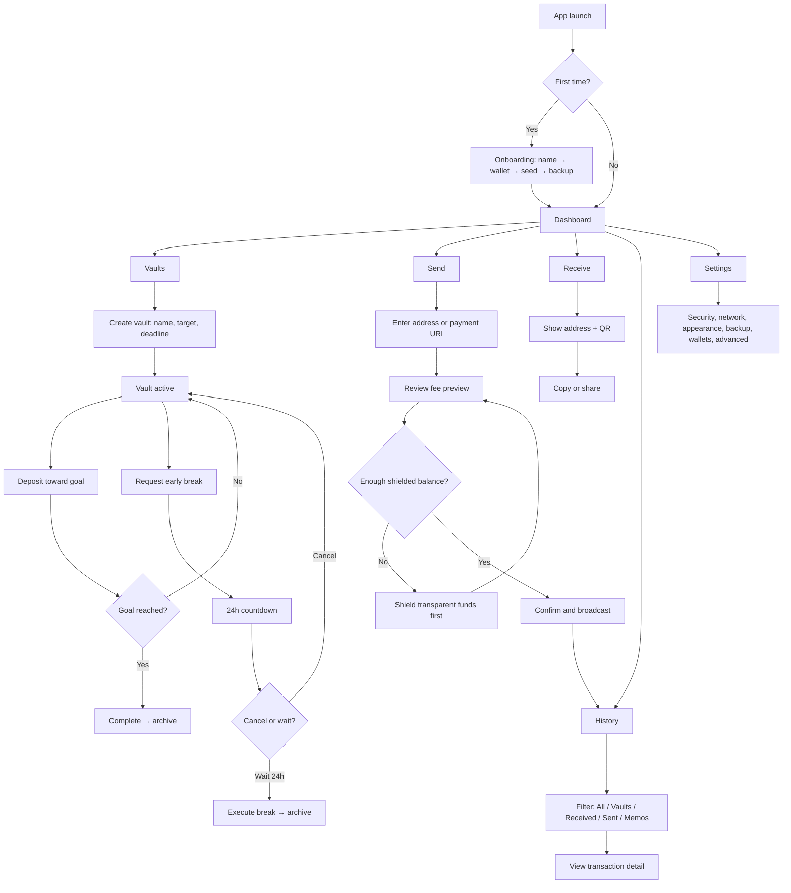

# User flow

This page walks through the full ZecVault experience from first launch to everyday use.

---

## First launch: onboarding

New users go through a 4-step onboarding flow before reaching the main app.

```
Step 1: Name       →  Step 2: Wallet setup  →  Step 3: Seed phrase  →  Step 4: Backup
```

### Step 1 — What should we call you?

Just a display name. It's stored only on the device, never sent anywhere.

### Step 2 — Wallet setup

Choose **Create new wallet** or **I have a seed phrase** (restore). Either way, you also set a password here (minimum 8 characters). The password is used to encrypt your seed phrase on disk — it's not an account password and there's no server to reset it.

### Step 3 — Seed phrase

**Create path:** The app generates a 24-word seed phrase. The words are blurred until you click "Reveal" — this prevents screen-sharing accidents. After reading them, you verify four randomly chosen words to confirm you've written them down.

**Restore path:** Paste your existing 24-word phrase. You can optionally enter a birthday block height — the approximate block number when the wallet was first used. Providing this makes the initial sync much faster. Leave it blank if you're unsure; the wallet will scan everything.

### Step 4 — Backup

You can download a backup `.txt` file containing your seed phrase. This is optional, but if your device is lost or damaged, this file (combined with your password) is the only way to recover your funds. Store it somewhere offline.

Check the confirmation box, then click "Enter ZecVault".

---

## Main navigation

After onboarding, the sidebar gives access to five areas:

| Section | What it's for |
|---|---|
| Dashboard | Overview of your balance and recent activity |
| Vaults | Your savings goals |
| Send | Send ZEC to another address |
| Receive | Show your address and QR code |
| History | Full transaction history with filters |

Settings are accessible from the sidebar as well.

---

## Vaults

Vaults are the core savings feature. Each vault has a name, a target ZEC amount, and a deadline.

**Creating a vault** — tap "New Vault", pick a category, enter a goal name, set the amount and deadline. The vault shows up in your list immediately with a progress bar at 0%.

**Depositing** — open a vault and tap "Deposit". This can be a manual local credit (no transaction) or a real Zcash transaction to the vault's dedicated address. If you send on-chain, include the vault memo so the app can match the deposit after sync.

**Progress** — the vault tracks your contribution streak (how many consecutive days you've deposited) alongside the total amount.

**Goal complete** — when the balance reaches the target, the vault shows a "Goal Complete" screen. Tap to archive it. The ZEC is released back to your spendable balance.

**Breaking a vault early** — if you need the funds before the goal, tap "Break vault". A 24-hour countdown starts. You can cancel during this window. After 24 hours, tap to confirm the withdrawal. The vault moves to your archive.

---

## Send

The send screen accepts any Zcash address: unified (`u1...`), Sapling (`zs1...`), or transparent (`t1...`). You can also paste a payment URI (`zcash:address?amount=0.5`) — the app parses the address, amount, and memo automatically.

The app labels addresses as **Private (shielded)** or **Public (transparent)**. Sending to a transparent address shows an extra confirmation step to make sure the choice is intentional.

Before you send, the app fetches a fee preview from the wallet backend. You see the exact fee and total debit before confirming.

If your shielded balance is too low but you have transparent funds, the app prompts you to **Shield funds first** — this sweeps your transparent ZEC into your Orchard balance in a separate transaction, then you can retry the send.

---

## Receive

The receive screen shows your address and a QR code. The default is your **Unified Address** (Orchard + Sapling) — this works with most modern Zcash wallets and keeps your funds in the shielded pool.

Below the QR code, there's a 4-word alias derived from your address. This is a quick visual fingerprint: if the alias matches what the sender shows, the address is correct. If any word is different, something went wrong with the paste.

Expert Address Mode (Settings → Advanced) unlocks additional address options: Orchard-only, Sapling-only, and various transparent combinations for specific use cases like exchanges or legacy integrations.

---

## History

The history screen shows all transactions with filter tabs:

- **All** — everything
- **Vaults** — deposits and withdrawals linked to vault goals
- **Received** — incoming transactions
- **Sent** — outgoing transactions
- **Memos** — transactions that contain a memo

Tap any transaction to see the full details: txid, block height, fee, receiving pool (Orchard/Sapling/transparent), and memo text if present.

---

## Settings

| Section | What you can change |
|---|---|
| Security | Biometrics, PIN, lock app immediately |
| Network | Lightwalletd server URL, switch between mainnet and testnet |
| Appearance | Theme (light/dark/forest), display currency, ZEC decimal places |
| Backup | Export all wallet seed phrases to a file |
| Wallets | Add an account (same seed, new derivation), rename, set birthday, remove |
| Advanced | Round-up savings, expert address mode, Sapling→Orchard migration, reset app |

---

## Full flow diagram


