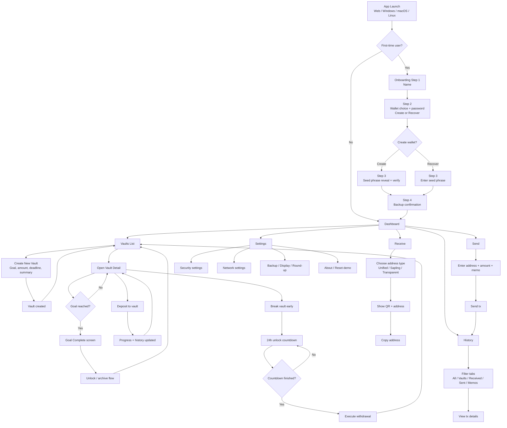

# ZecVault User Flow Diagram

This diagram reflects the current implemented flow across web and desktop shells.

## Notes

- Navigation shell is consistent across `apps/windows`, `apps/macos`, and `apps/linux`.
- Vault detail navigation uses a stable route path and query id for packaged desktop reliability.
- Onboarding completion gates entry into the main app shell.
